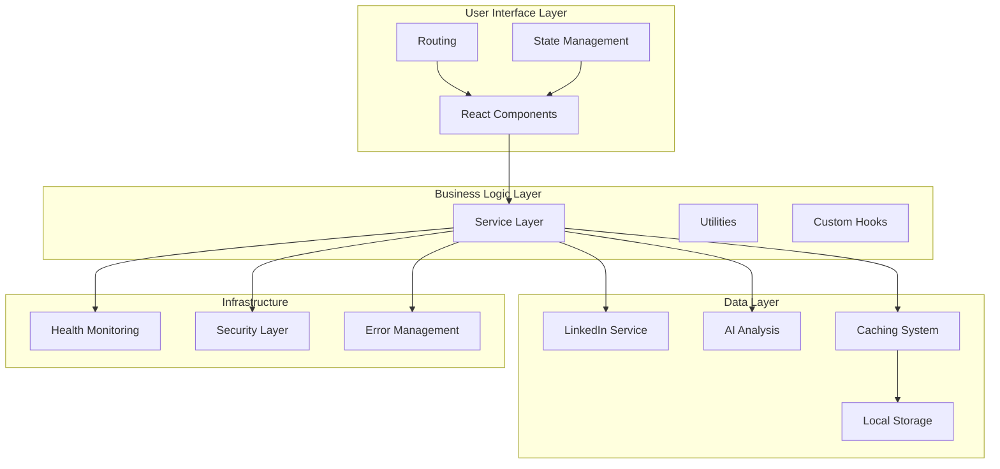

# Architecture Overview

## System Architecture

The LinkedIn Analytics & Growth Advisor follows a modern, component-based architecture designed for scalability, maintainability, and performance. The application is built using React with TypeScript and follows clean architecture principles.

## High-Level Architecture



## Core Architectural Principles

### 1. **Separation of Concerns**
- Clear separation between UI, business logic, and data layers
- Each component has a single responsibility
- Modular design for easy testing and maintenance

### 2. **Component-Based Architecture**
- Reusable UI components with consistent interfaces
- Composition over inheritance pattern
- Props-based communication between components

### 3. **Declarative Programming**
- React's declarative approach for UI rendering
- Functional programming patterns where applicable
- Immutable state management

### 4. **Progressive Enhancement**
- Core functionality works without JavaScript
- Enhanced experience with modern browser features
- Graceful degradation for older browsers

## Detailed Architecture Layers

### Presentation Layer

#### React Components Hierarchy
```
App.tsx
├── ErrorFallback.tsx (Error Boundaries)
├── components/
│   ├── ui/ (Base UI Components)
│   │   ├── card.tsx
│   │   ├── button.tsx
│   │   ├── input.tsx
│   │   └── ... (shadcn/ui components)
│   ├── features/ (Feature Components)
│   │   ├── analysis/
│   │   ├── profile/
│   │   └── dashboard/
│   └── layout/ (Layout Components)
│       ├── Header.tsx
│       ├── Footer.tsx
│       └── Navigation.tsx
```

#### State Management Strategy
- **Local State**: React useState for component-specific state
- **Shared State**: React Context API for global state
- **Server State**: Custom hooks for API data management
- **Form State**: Controlled components with validation

### Business Logic Layer

#### Service Architecture
```typescript
// Core service interfaces
interface LinkedInService {
  getProfileData(username: string): Promise<ProfileData>
  getProfileInsights(username: string, data: ProfileData): Promise<Insights>
}

interface AIAnalysisService {
  analyzeProfile(data: ProfileData): Promise<Analysis>
  generateRecommendations(analysis: Analysis): Promise<Recommendation[]>
}

interface CacheService {
  get<T>(key: string): Promise<T | null>
  set<T>(key: string, value: T, ttl?: number): Promise<void>
  invalidate(pattern: string): Promise<void>
}
```

#### Custom Hooks Pattern
```typescript
// Business logic encapsulated in custom hooks
export function useProfileAnalysis() {
  const [data, setData] = useState<ProfileData | null>(null)
  const [loading, setLoading] = useState(false)
  const [error, setError] = useState<Error | null>(null)
  
  const analyzeProfile = useCallback(async (username: string) => {
    // Implementation
  }, [])
  
  return { data, loading, error, analyzeProfile }
}
```

### Data Layer

#### LinkedIn Service Integration
```typescript
class LinkedInService {
  // Multi-strategy data fetching
  async getProfileData(username: string): Promise<ProfileData> {
    try {
      // 1. Try real-time scraping
      const scrapingResult = await this.scrapeProfile(username)
      if (scrapingResult.success) return scrapingResult.data
      
      // 2. Fallback to AI analysis
      return await this.generateAIProfile(username)
    } catch (error) {
      throw new ProfileAnalysisError('Failed to fetch profile data')
    }
  }
}
```

#### Caching Strategy
- **Memory Cache**: In-memory LRU cache for frequently accessed data
- **Browser Storage**: localStorage for user preferences and session data
- **API Response Cache**: HTTP response caching with TTL
- **Component Memoization**: React.memo and useMemo for expensive operations

### Infrastructure Layer

#### Error Handling Architecture
```typescript
class ErrorService {
  private errorQueue: Array<ErrorReport> = []
  
  logError(error: Error, context?: string): void {
    const report = {
      message: error.message,
      stack: error.stack,
      timestamp: Date.now(),
      context,
      userAgent: navigator.userAgent
    }
    
    this.errorQueue.push(report)
    this.throttledReport()
  }
}
```

#### Security Layer
- **Input Validation**: All user inputs sanitized and validated
- **Rate Limiting**: Configurable request throttling
- **XSS Protection**: Content sanitization
- **CORS Configuration**: Proper cross-origin resource sharing

## Design Patterns

### 1. **Factory Pattern**
```typescript
// Component factory for dynamic component creation
export const ComponentFactory = {
  createAnalysisCard(type: AnalysisType): React.ComponentType {
    switch (type) {
      case 'skills': return SkillsAnalysisCard
      case 'experience': return ExperienceAnalysisCard
      case 'network': return NetworkAnalysisCard
      default: return DefaultAnalysisCard
    }
  }
}
```

### 2. **Observer Pattern**
```typescript
// Event system for cross-component communication
class EventBus {
  private listeners: Map<string, Function[]> = new Map()
  
  on(event: string, callback: Function): void {
    if (!this.listeners.has(event)) {
      this.listeners.set(event, [])
    }
    this.listeners.get(event)?.push(callback)
  }
  
  emit(event: string, data: any): void {
    this.listeners.get(event)?.forEach(callback => callback(data))
  }
}
```

### 3. **Strategy Pattern**
```typescript
// Different analysis strategies
interface AnalysisStrategy {
  analyze(data: ProfileData): Promise<AnalysisResult>
}

class AIAnalysisStrategy implements AnalysisStrategy {
  async analyze(data: ProfileData): Promise<AnalysisResult> {
    // AI-based analysis implementation
  }
}

class RuleBasedAnalysisStrategy implements AnalysisStrategy {
  async analyze(data: ProfileData): Promise<AnalysisResult> {
    // Rule-based analysis implementation
  }
}
```

## Performance Architecture

### Code Splitting Strategy
```typescript
// Route-based code splitting
const ProfileAnalysis = lazy(() => import('./components/ProfileAnalysis'))
const Dashboard = lazy(() => import('./components/Dashboard'))
const Settings = lazy(() => import('./components/Settings'))

// Component-based splitting
const AdvancedAnalytics = lazy(() => 
  import('./components/AdvancedAnalytics').then(module => ({
    default: module.AdvancedAnalytics
  }))
)
```

### Optimization Techniques
- **Bundle Splitting**: Vendor chunks separated from application code
- **Tree Shaking**: Unused code elimination
- **Lazy Loading**: Dynamic imports for non-critical components
- **Memoization**: Expensive operations cached
- **Virtual Scrolling**: Large lists rendered efficiently

## Scalability Considerations

### Horizontal Scaling
- **Stateless Design**: No server-side state dependencies
- **CDN Integration**: Static assets served from CDN
- **API Rate Limiting**: Prevents system overload
- **Caching Layers**: Multiple levels of caching

### Vertical Scaling
- **Memory Management**: Automatic cleanup and monitoring
- **Performance Monitoring**: Real-time metrics tracking
- **Resource Optimization**: Efficient resource utilization

## Security Architecture

### Input Validation
```typescript
const validateLinkedInUsername = (username: string): ValidationResult => {
  const sanitized = DOMPurify.sanitize(username.trim())
  
  if (!sanitized || sanitized.length === 0) {
    return { isValid: false, error: 'Username is required' }
  }
  
  if (sanitized.length > CONFIG.MAX_INPUT_LENGTH) {
    return { isValid: false, error: 'Username too long' }
  }
  
  const linkedinUrlPattern = /^[\w\-_.]+$/
  if (!linkedinUrlPattern.test(sanitized)) {
    return { isValid: false, error: 'Invalid username format' }
  }
  
  return { isValid: true, value: sanitized }
}
```

### Rate Limiting
```typescript
class RateLimiter {
  private requests: Map<string, number[]> = new Map()
  
  canMakeRequest(identifier: string, limit: number, windowMs: number): boolean {
    const now = Date.now()
    const requests = this.requests.get(identifier) || []
    
    // Remove old requests outside the window
    const validRequests = requests.filter(time => now - time < windowMs)
    
    if (validRequests.length >= limit) {
      return false
    }
    
    validRequests.push(now)
    this.requests.set(identifier, validRequests)
    return true
  }
}
```

## Monitoring & Observability

### Health Monitoring
```typescript
class HealthMonitor {
  async checkHealth(): Promise<HealthStatus> {
    const checks = await Promise.allSettled([
      this.checkMemoryUsage(),
      this.checkCacheHealth(),
      this.checkAPIResponsiveness(),
      this.checkErrorRates()
    ])
    
    return {
      status: checks.every(c => c.status === 'fulfilled') ? 'healthy' : 'degraded',
      checks: checks.map(this.formatCheckResult),
      timestamp: Date.now()
    }
  }
}
```

### Performance Metrics
- **Core Web Vitals**: LCP, FID, CLS tracking
- **Custom Metrics**: Component render times, API response times
- **Error Tracking**: Error rates and categorization
- **User Experience**: User journey analytics

## Technology Integration

### Build System (Vite)
```typescript
// vite.config.ts
export default defineConfig({
  build: {
    rollupOptions: {
      output: {
        manualChunks: {
          'vendor': ['react', 'react-dom'],
          'ui': ['@radix-ui/react-dialog', '@radix-ui/react-popover'],
          'analytics': ['framer-motion', 'chart.js']
        }
      }
    }
  },
  plugins: [
    react(),
    // Performance optimizations
  ]
})
```

### Type System Integration
```typescript
// Strong typing throughout the application
interface ProfileAnalysisProps {
  username: string
  onAnalysisComplete: (result: AnalysisResult) => void
  onError: (error: AnalysisError) => void
}

type AnalysisResult = {
  profile: ProfileData
  insights: InsightData[]
  recommendations: Recommendation[]
  metadata: AnalysisMetadata
}
```

This architecture provides a solid foundation for a scalable, maintainable, and high-performance LinkedIn analytics application while following modern React development best practices.