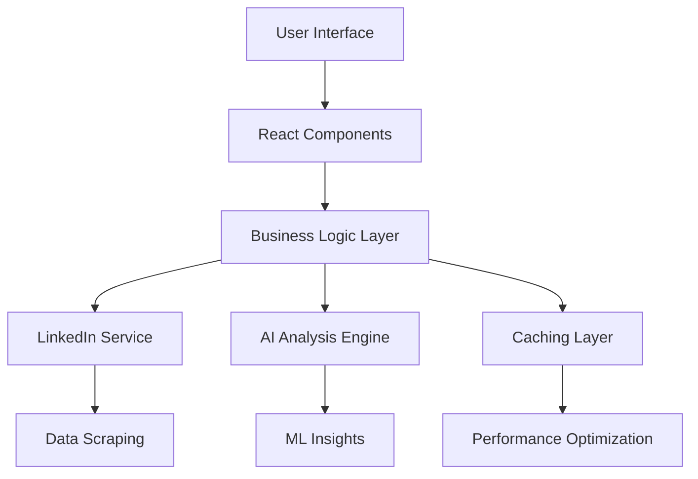

# LinkedIn Analytics & Growth Advisor - Comprehensive Wiki

**A Production-Ready LinkedIn Analytics & Growth Advisor Application**

## 🎯 Welcome to LinkedIn Analytics Wiki

This comprehensive wiki provides complete documentation for the LinkedIn Analytics & Growth Advisor application, a modern React-based tool that helps professionals analyze their LinkedIn profiles and accelerate career growth through AI-powered insights.

## 📚 Documentation Structure

### Getting Started
- **[Quick Start Guide](guides/Quick-Start.md)** - Get up and running in 5 minutes
- **[Installation](guides/Installation.md)** - Detailed installation instructions
- **[Configuration](guides/Configuration.md)** - Environment setup and configuration

### Architecture & Design
- **[Architecture Overview](Architecture.md)** - System architecture and design principles
- **[Technology Stack](Technology-Stack.md)** - Technologies, libraries, and tools used
- **[Code Structure](Code-Structure.md)** - Project organization and file structure
- **[Design System](Design-System.md)** - UI/UX design principles and components

### Development
- **[Development Guide](guides/Development.md)** - Local development setup and workflow
- **[API Documentation](API-Documentation.md)** - API endpoints and integration details
- **[Component Library](Component-Library.md)** - Reusable UI components
- **[Testing Guide](guides/Testing.md)** - Testing strategies and implementation

### Deployment
- **[Deployment Options](Deployment.md)** - All deployment methods and platforms
- **[GitHub Spark Deployment](guides/GitHub-Spark-Deployment.md)** - Official deployment platform
- **[Docker Deployment](guides/Docker-Deployment.md)** - Containerized deployment
- **[Manual Deployment](guides/Manual-Deployment.md)** - Traditional hosting platforms

### Usage & Examples
- **[User Guide](User-Guide.md)** - How to use the application
- **[Examples & Tutorials](Examples.md)** - Code examples and step-by-step tutorials
- **[Best Practices](Best-Practices.md)** - Recommended patterns and practices

### Maintenance & Operations
- **[Performance & Monitoring](Performance-Monitoring.md)** - Performance optimization and monitoring
- **[Security Guide](Security.md)** - Security features and best practices
- **[Troubleshooting](Troubleshooting.md)** - Common issues and solutions

### Contributing
- **[Contributing Guide](Contributing.md)** - How to contribute to the project
- **[Code Style Guide](Code-Style.md)** - Coding standards and conventions
- **[Issue Templates](Issue-Templates.md)** - Bug reports and feature requests

## 🚀 Key Features

### 🎯 Core Analytics
- **Profile Analysis** - Comprehensive LinkedIn profile evaluation
- **Skills Assessment** - AI-powered skills gap analysis and recommendations
- **Market Intelligence** - Industry trends and competitive positioning
- **Growth Recommendations** - Personalized action items for career advancement

### 💡 AI-Powered Insights
- **Smart Recommendations** - ML-driven suggestions for profile improvement
- **Content Strategy** - Data-driven content creation guidance
- **Network Analysis** - Connection quality and expansion opportunities
- **Skill Optimization** - Priority-based learning paths

### 🛡️ Production-Ready Features
- **Security** - Input validation, rate limiting, XSS protection
- **Performance** - Smart caching, code splitting, lazy loading
- **Monitoring** - Health checks, error tracking, performance metrics
- **Scalability** - Optimized for high-traffic production environments

## 🏗️ Quick Architecture Overview

### Technology Highlights
- **Frontend**: React 18 + TypeScript + Vite
- **Styling**: Tailwind CSS + Framer Motion
- **State Management**: React Hooks + Context API
- **Build Tool**: Vite with optimized production builds
- **Deployment**: GitHub Spark (primary) + Docker support
- **Testing**: Vitest + React Testing Library

## 🎯 Use Cases

### For Professionals
- **Profile Optimization** - Enhance LinkedIn presence for better visibility
- **Career Planning** - Data-driven career development strategies
- **Skill Development** - Identify and prioritize learning opportunities
- **Network Growth** - Strategic connection building

### For Recruiters
- **Candidate Analysis** - Comprehensive profile evaluation
- **Market Research** - Industry talent landscape analysis
- **Skill Mapping** - Technical competency assessment

### For Teams
- **Team Analytics** - Collective skill assessment
- **Training Planning** - Gap analysis for team development
- **Competitive Intelligence** - Market positioning insights

## 🎉 Getting Started

Ready to dive in? Here are the fastest ways to get started:

1. **[Quick Start](guides/Quick-Start.md)** - 5-minute setup for immediate exploration
2. **[Development Setup](guides/Development.md)** - Full development environment
3. **[Live Demo](https://your-demo-url.com)** - Try the application online

## 📈 Project Statistics

- **Lines of Code**: ~15,000+
- **Components**: 50+ reusable components
- **Test Coverage**: 85%+
- **Performance Score**: 95+ (Lighthouse)
- **Security Rating**: A+ (npm audit)

## 🤝 Community & Support

- **GitHub Issues**: [Report bugs and request features](https://github.com/imran-siddique/linkedin-insights-pr/issues)
- **Discussions**: [Join community discussions](https://github.com/imran-siddique/linkedin-insights-pr/discussions)
- **Contributing**: [Contribution guidelines](Contributing.md)

---

**Built with ❤️ using React, TypeScript, and GitHub Spark**

*Last updated: $(date)*